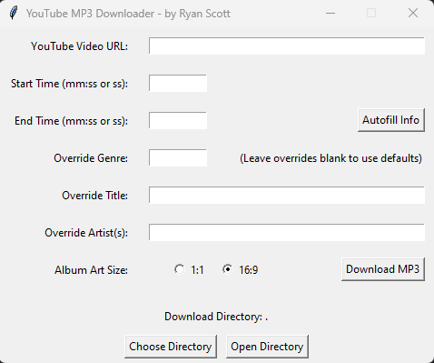

# YouTube to MP3 Downloader

## Overview
This project is a Python-based YouTube to MP3 downloader with the capability to extract specific sections of a video and convert them into MP3 format. It features metadata editing and automatic thumbnail handling. The application also provides a graphical interface (GUI) for ease of use, using the tkinter library. The tool leverages the yt-dlp package for downloading video and audio content, and ffmpeg for handling audio processing.

## Features
* Download specific sections of YouTube videos as MP3 files.
* Autofill artist and title information from YouTube video metadata.
* Option to override the genre, artist, and title of the downloaded MP3 file.
* Automatic thumbnail downloading and cropping (aspect ratio options: 1:1 or 16:9).
* Edit MP3 metadata (artist, genre, album art).
* Graphical interface (GUI) for user-friendly interaction.
* Allows users to select a custom download directory.

## GUI Controls
* **YouTube Video URL:** Paste the URL of the YouTube video you want to download.
* **Start Time:** Set the start time (optional) of the video section you want to extract, in mm:ss or ss format.
* **End Time:** Set the end time (optional) for clipping the section.
* **Autofill Info:** Automatically fetches artist and title from YouTube metadata.
* **Override Genre:** Specify a genre for the MP3 file (leave blank to use folder name).
* **Override Title/Artist:** Optionally override the title and artist with custom values.
* **Album Art Size:** Choose whether the thumbnail should be 1:1 or 16:9 aspect ratio.
* **Choose Directory:** Select the download directory.
* **Open Directory:** Open the selected download directory.
* **Download MP3:** Start the download and metadata processing.

## Files
* **main.py:** Contains the main logic for the GUI interface, downloading process, and event handling.
* **downloader.py:** Handles the download of video sections as MP3, thumbnail fetching, and cropping.
* **metadata.py:** Contains functions to edit MP3 metadata (e.g., artist, genre, album art).
* **utils.py:** Utility functions for timestamp conversion, filename sanitization, and genre/artist formatting.
